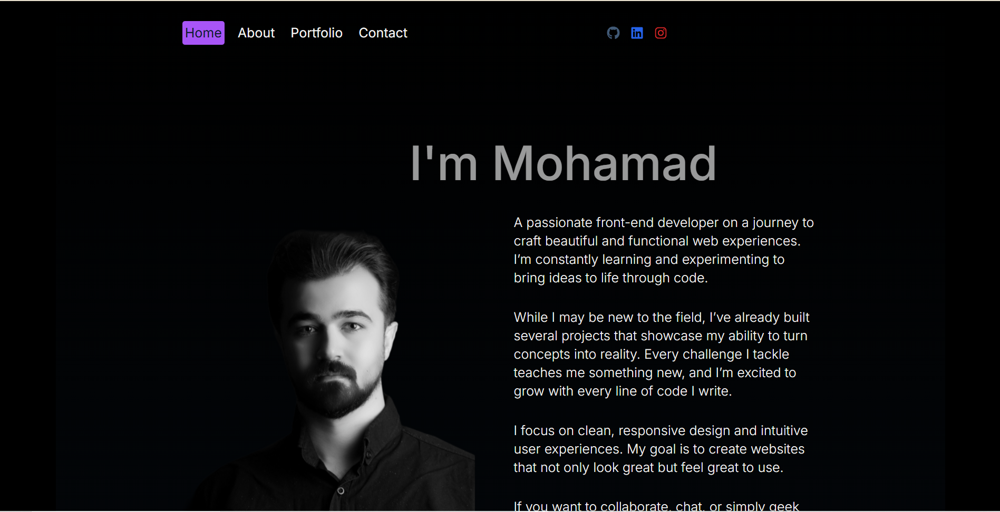
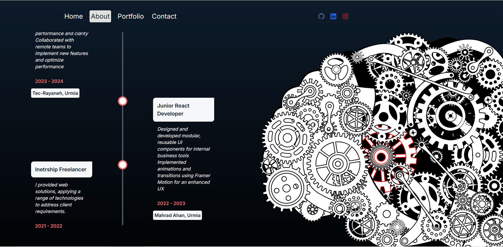

# Modern Animated Portfolio

live-demo: [LIVE-DEMO:](https://mohamad-abdolahi.vercel.app)

A stunning, responsive portfolio website built with Next.js and Framer Motion, featuring smooth animations and a modern design aesthetic.



## ✨ Features

- 🎨 Modern and clean design with glass-morphism effects
- ⚡ Built with Next.js 13+ and React
- 🎭 Smooth animations powered by Framer Motion
- 📱 Fully responsive design
- 🌙 Dark mode support
- 🎯 Interactive project showcase
- 🔍 SEO optimized
- 🚀 Fast performance and optimized loading



## 🛠️ Technologies Used

- [Next.js](https://nextjs.org/) - React framework for production
- [React](https://reactjs.org/) - JavaScript library for building user interfaces
- [Framer Motion](https://www.framer.com/motion/) - Animation library
- [Tailwind CSS](https://tailwindcss.com/) - Utility-first CSS framework
- [React Icons](https://react-icons.github.io/react-icons/) - Icon library
- [Date-fns](https://date-fns.org/) - Date utility library

## 🚀 Getting Started

### Prerequisites

- Node.js 14.6.0 or newer
- npm or yarn

### Installation

1. Clone the repository:

```bash
git clone https://github.com/mohamad8616/portfolio.git
```

2.Navigate to the project directory:

```bash
cd next-animated-portfolio
```

3.Install dependencies:

```bash
npm install
# or
yarn install
```

4.Run the development server:

```bash
npm run dev
# or
yarn dev
```

5.Open [http://localhost:3000](http://localhost:3000) in your browser to see the result.

## 📁 Project Structure

```├── src/
│   ├── app/              # App router pages
│   ├── components/       # React components
│   ├── utility/         # Utility functions and data
│   └── styles/          # Global styles
├── public/              # Static assets
└── ...
```

## 🎨 Customization

### Modifying Projects

Edit the `src/utility/data.js` file to update your projects:

```javascript
export const items = [
  {
    id: 1,
    title: "Project Name",
    desc: "Project description",
    img: "/project-image.jpg",
    link: "https://project-link.com",
    github: "https://github.com/username/project",
    technologies: ["React", "Node.js", "MongoDB"],
    createdAt: new Date("2024-01-01"),
  },
  // Add more projects...
];
```

### Styling

The project uses Tailwind CSS for styling. You can customize the theme in `tailwind.config.js`.

## 📱 Responsive Design

The portfolio is fully responsive and optimized for:

- Desktop
- Tablet
- Mobile devices

## 🚀 Deployment

The easiest way to deploy your Next.js app is to use the [Vercel Platform](https://vercel.com/new).

## 📝 License

This project is licensed under the MIT License - see the [LICENSE](LICENSE) file for details.

## 👨‍💻 Author

### Mohamad Abdolahi

- GitHub: [@mohamad8616](https://github.com/mohamad8616)
- LinkedIn: [Mohamad Abdolahi](https://www.linkedin.com/in/mohamad-abdolahi)

## 🙏 Acknowledgments

- Design inspiration from various modern portfolios
- Icons from [React Icons](https://react-icons.github.io/react-icons/)
- Animation patterns from [Framer Motion](https://www.framer.com/motion/)
